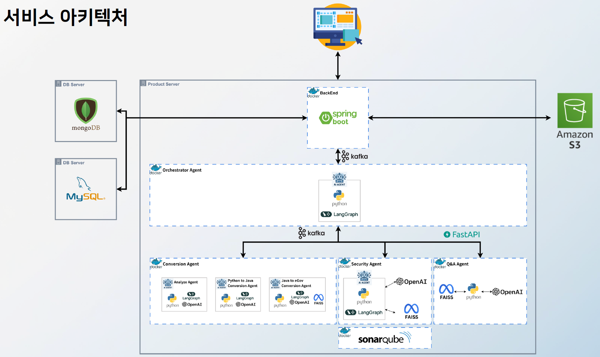
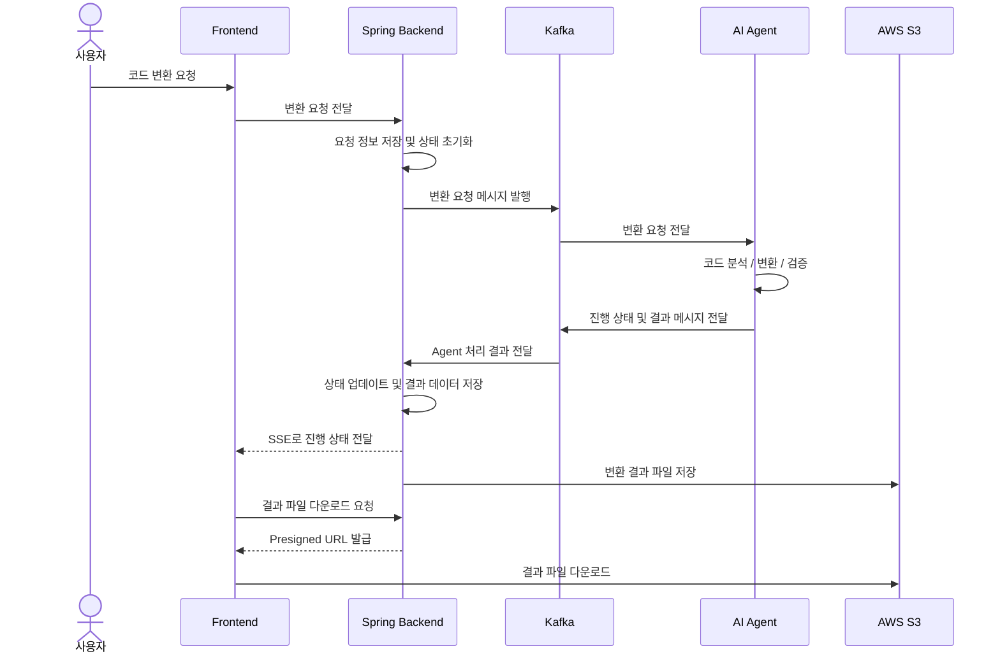
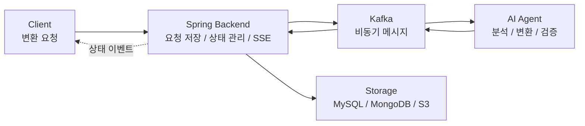

# AI 기반 프레임워크 변환 플랫폼

## 프로젝트 요약

- **코드 변환 자동화**: eGovFrame과 Spring Boot 간 코드 변환 작업을 웹에서 요청하고 관리
- **비동기 처리 구조**: Kafka를 활용해 Spring Backend와 AI Agent 간 변환 요청/결과 흐름 분리
- **AI Agent 연동**: Python, LangGraph 기반 Agent가 코드 분석, 변환, 검증 흐름 수행
- **실시간 상태 전달**: SSE(Server-Sent Events)를 활용해 변환 진행 상태를 클라이언트에 전달
- **파일/데이터 관리**: AWS S3, Presigned URL, MySQL, MongoDB를 활용해 파일과 변환 데이터를 역할별로 관리

## 1. 프로젝트 개요

AI 기반 프레임워크 변환 플랫폼은 eGovFrame과 Spring Boot 간 코드 변환을 자동화하고, 변환 과정과 결과를 실시간으로 확인할 수 있도록 지원하는 플랫폼입니다.

본 시스템은 단순 변환 기능을 넘어 여러 AI Agent를 활용해 코드 분석, 변환, 검증을 수행하는 구조로 설계되었습니다. 백엔드는 사용자의 변환 요청을 처리하고, Kafka를 통해 Agent 시스템과 비동기적으로 연동하며, 변환 상태와 결과 파일을 관리하는 역할을 담당했습니다.

### 프로젝트 정보

| 항목 | 내용 |
| --- | --- |
| 기간 | 2025.06 ~ 2025.09 |
| 형태 | 교육/팀 프로젝트 |
| 인원 | 8명 |
| 담당 역할 | 백엔드 개발 |
| 기술 스택 | Java, Spring Boot, Kafka, SSE, AWS S3, Presigned URL, MySQL, MongoDB |

## 2. 시스템 아키텍처

### 아키텍처 설명

| 구성 요소 | 역할 |
| --- | --- |
| Frontend | 코드 변환 요청, 변환 상태 조회, 결과 파일 다운로드 화면 제공 |
| Spring Backend | 클라이언트 요청 처리, 변환 요청/상태 관리, Kafka/S3/DB 연동 |
| AI Agent | Python/LangGraph 기반 코드 분석, 변환, 검증 수행 |
| Kafka | Backend와 Agent 간 비동기 메시지 통신 |
| MySQL | 변환 요청, 작업 상태 등 정형 데이터 저장 |
| MongoDB | 변환 결과, 로그성 데이터, 비정형 데이터 저장 |
| AWS S3 | 변환 결과 파일 저장 및 다운로드 지원 |

## 3. 데이터 처리 흐름

코드 변환 요청부터 결과 반환까지의 흐름은 **Backend ↔ AI Agent 간 Kafka 기반 비동기 처리**와 **Backend ↔ Frontend 간 SSE 기반 상태 전달**로 나누어 구성했습니다.

### 단계별 처리 흐름

### 처리 단계 요약

- 변환 요청 수신 후 요청 정보와 초기 상태 저장
- Kafka를 통해 Backend와 Agent 처리 흐름 분리
- AI Agent에서 코드 분석, 변환, 검증 수행
- Agent 처리 결과와 상태 정보를 Kafka로 전달
- Backend에서 상태를 업데이트하고 SSE로 클라이언트에 전달
- 변환 결과 파일을 S3에 저장하고 다운로드 URL 제공

## 4. Backend 구현 및 역할

### 담당 범위

| 구분 | 담당 내용 |
| --- | --- |
| API 서버 | Spring Boot 기반 코드 변환 요청, 상태 조회, 결과 파일 다운로드 API 설계/구현 |
| Kafka 연동 | 변환 요청 메시지 발행, Agent 처리 결과 수신, 상태 기반 처리 흐름 구성 |
| 실시간 상태 전달 | SSE를 활용해 변환 진행 상태를 클라이언트에 실시간 전달 |
| 파일 관리 | AWS S3와 Presigned URL을 활용한 결과 파일 저장 및 다운로드 흐름 구성 |
| 데이터 관리 | MySQL과 MongoDB를 역할에 따라 분리하여 요청/상태/결과 데이터 관리 |

### 주요 구현

- 코드 변환 요청 API, 변환 상태 조회 API, 결과 파일 다운로드 API를 구현했습니다.
- Kafka Producer를 통해 변환 요청 메시지를 발행하고, Kafka Consumer로 Agent 처리 결과를 수신했습니다.
- 변환 진행 상태를 SSE로 전달하여 사용자가 화면에서 작업 진행 상황을 확인할 수 있도록 구성했습니다.
- 변환 결과 파일을 S3에 저장하고, Presigned URL을 통해 클라이언트가 직접 다운로드할 수 있도록 설계했습니다.
- MySQL은 요청과 상태 같은 정형 데이터를 관리하고, MongoDB는 변환 결과와 비정형 데이터를 저장하도록 분리했습니다.

## 5. 주요 설계 포인트

백엔드는 클라이언트 요청 처리와 함께 Kafka, AI Agent, DB, S3 연동을 담당하며, 변환 요청부터 결과 저장까지의 흐름을 관리하도록 구성했습니다.

| 설계 포인트 | Before | 설계 판단 | After |
| --- | --- | --- | --- |
| 비동기 처리 구조 | 요청-응답 방식으로 변환 처리 API 응답 지연과 서버 블로킹 가능 | 코드 변환은 처리 시간이 긴 작업이므로 요청 처리와 변환 수행을 분리해야 함 | Kafka 기반 Backend → Agent 구조로 분리 요청은 즉시 응답하고 변환은 별도 처리 |
| 실시간 상태 전달 | 완료 전까지 진행 상태 확인 어려움 Polling 적용 시 요청 증가 | 변환 상태는 서버에서 클라이언트로 단방향 전달하면 충분함 | SSE로 상태 변경 이벤트 전달 불필요한 Polling 요청 감소 |
| 파일 처리 분리 | 서버가 파일 업로드/다운로드 직접 중계 대용량 파일 처리 시 서버 부담 증가 | 파일 전송은 애플리케이션 서버와 분리하는 것이 확장성에 유리함 | S3와 Presigned URL 기반 다운로드 구성 서버는 URL 발급과 메타데이터 관리에 집중 |
| 데이터 구조 분리 | 정형/비정형 데이터를 하나의 저장소에서 관리 | 요청/상태와 변환 결과 데이터는 구조와 조회 방식이 다름 | MySQL은 요청/상태 관리 MongoDB는 변환 결과와 비정형 데이터 저장 |

## 6. 문제 해결

### 1. 변환 작업 처리 시 응답 지연

| 항목 | 내용 |
| --- | --- |
| 문제 | 코드 변환 작업은 처리 시간이 오래 걸려 요청-응답 방식에서는 API 응답 지연과 서버 블로킹이 발생할 수 있음 |
| 원인 | 변환 작업을 동기적으로 처리하면 요청 처리 시간이 길어지고 서버 스레드가 장시간 점유됨 |
| 해결 | Kafka 기반 비동기 처리 구조로 요청 처리와 실제 변환 작업을 분리 Backend → Kafka → Agent 구조로 변경 |
| 결과 | 요청 처리와 변환 수행 흐름 분리 Backend는 요청 접수와 상태 관리 담당 AI Agent는 코드 분석과 변환 처리 담당 |

### 2. 변환 진행 상태 확인 불가

| 항목 | 내용 |
| --- | --- |
| 문제 | 변환 작업이 비동기로 처리되면서 사용자가 현재 진행 상태를 확인하기 어려움 |
| 원인 | 요청 이후 완료 시점까지 상태를 확인할 수 있는 전달 구조가 없고, Polling 방식은 불필요한 요청을 증가시킴 |
| 해결 | SSE를 적용하여 서버에서 클라이언트로 상태 변경 이벤트를 실시간 전달 |
| 결과 | Backend가 Agent 진행 상태를 수신해 클라이언트에 전달 완료 전까지 작업 상태 확인 가능 Polling 없이 서버 이벤트 기반 상태 전달 |

### 3. 파일 업로드/다운로드 시 서버 부하

| 항목 | 내용 |
| --- | --- |
| 문제 | 변환 결과 파일을 서버를 통해 업로드/다운로드하면 서버 부하와 병목이 발생할 수 있음 |
| 원인 | 모든 파일 요청이 서버를 경유하고, 대용량 파일 처리 시 네트워크와 서버 자원 부담이 증가함 |
| 해결 | AWS S3와 Presigned URL을 활용하여 클라이언트가 파일을 직접 다운로드하도록 구성 서버는 Presigned URL 생성만 담당 |
| 결과 | 파일 전송 경로를 애플리케이션 서버와 분리 서버는 URL 발급과 파일 메타데이터 관리 담당 S3 중심의 결과 파일 다운로드 흐름 구성 |

### 4. 데이터 관리 복잡도 증가

| 항목 | 내용 |
| --- | --- |
| 문제 | 정형 데이터와 비정형 데이터가 하나의 DB에 혼합되면 데이터 관리와 확장성 측면에서 복잡도 증가 |
| 원인 | 요청/상태 데이터와 변환 결과 데이터는 데이터 특성과 저장 구조가 다름 |
| 해결 | MySQL과 MongoDB를 역할 기반으로 분리 MySQL은 요청/상태, MongoDB는 변환 결과 및 비정형 데이터 저장 |
| 결과 | 요청/상태 데이터와 변환 결과 데이터의 저장 위치 분리 데이터 성격에 맞는 관리 구조 마련 조회와 저장 책임 구분 |

## 7. 구현 결과

### 비동기 변환 처리 흐름 구축

Kafka를 활용해 Spring Backend와 AI Agent 간 변환 요청/결과 처리를 분리했습니다. 이를 통해 사용자의 요청 처리와 실제 변환 작업을 분리하고, 시간이 오래 걸리는 변환 작업을 안정적으로 처리할 수 있는 구조를 만들었습니다.

### 실시간 상태 확인 구조 구현

SSE를 활용하여 변환 진행 상태를 클라이언트에 전달하는 구조를 구현했습니다.

- 변환 작업 생성
- Kafka 기반 Agent 처리 요청
- 진행 상태 저장
- 상태 변경 이벤트 전달
- 완료/실패 상태 반영
- 결과 파일 다운로드 정보 제공

이를 통해 변환처럼 시간이 걸리는 작업에서도 사용자가 처리 흐름을 확인할 수 있는 기반을 마련했습니다.
