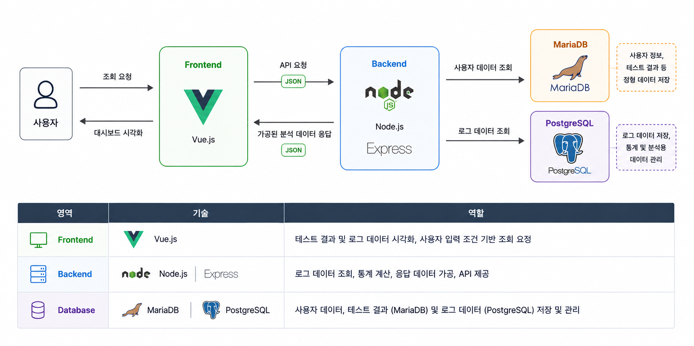
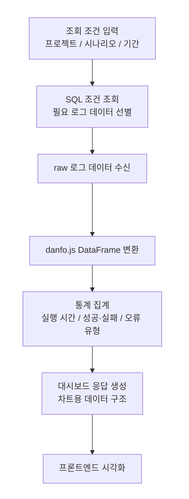

# 자동화 테스트 웹 모니터링 서비스

## 1. 프로젝트 개요

자동화 테스트 실행 결과와 로그 데이터를 수집, 분석하고 웹 대시보드를 통해 시각화하여 테스트 품질 개선을 지원하는 모니터링 시스템입니다.

단순 로그 조회를 넘어 로그 데이터를 분석 가능한 형태로 가공하고, 문제 원인 파악과 반복 오류 패턴 확인을 지원하는 구조로 설계했습니다.

### 프로젝트 정보

| 항목 | 내용 |
| --- | --- |
| 기간 | 2023.01 ~ 2024.02 |
| 소속 | 파이온닷컴 |
| 형태 | 실무 프로젝트 |
| 인원 | 2명 |
| 담당 역할 | 백엔드 개발 |
| 기술 스택 | Node.js, Express, Vue.js, JavaScript, MariaDB, PostgreSQL, AWS EC2, danfo.js |

## 2. 시스템 아키텍처



사용자는 Vue.js 기반 프론트엔드에서 조회 조건을 입력하고, 백엔드는 Node.js/Express 기반 API를 통해 사용자 데이터와 로그 데이터를 조회합니다. MariaDB는 사용자 정보와 테스트 결과 등 정형 데이터를 관리하고, PostgreSQL은 로그 데이터와 통계/분석용 데이터를 관리합니다.

## 3. 데이터 처리 흐름

로그 데이터 조회부터 통계 생성 및 시각화까지의 흐름은 **조회 → 가공 → 분석 → 응답** 구조로 구성했습니다.

### 처리 흐름



### 처리 단계 요약

- 요청 조건을 기반으로 테스트 로그 데이터 조회
- raw 로그 데이터를 danfo.js DataFrame으로 변환
- 실행 시간, 성공/실패, 오류 유형 기준으로 집계
- 차트 및 분석에 필요한 응답 데이터 생성
- 프론트엔드 대시보드에서 시각화

## 4. Backend 구현 및 역할

### 담당 범위

| 구분 | 담당 내용 |
| --- | --- |
| API 서버 | 테스트 결과 및 로그 조회를 위한 Node.js, Express 기반 API 설계/구현 |
| 데이터 조회 | 테스트 날짜, 결과, 시나리오 이름 등 사용자 입력 조건 기반 SQL 조회 로직 구현 |
| 데이터 처리 | MariaDB와 PostgreSQL의 테스트 관련 데이터를 조회하고 danfo.js DataFrame 기반으로 집계/통계 처리 |
| 응답 설계 | 성공/실패 비율, 오류 유형, 평균 실행 시간 등 대시보드 지표 생성을 위한 응답 데이터 구조 설계 |
| 데이터 관리 | 사용자 데이터와 테스트 데이터를 분리 관리하는 데이터 저장 구조 설계 및 연동 |

### 주요 구현

- 프로젝트, 시나리오, 기간 등 조회 조건을 기반으로 필요한 로그 데이터만 조회하는 API를 구현했습니다.
- SQL 단계에서 조회 범위를 줄이고, 선별된 raw 로그 데이터를 danfo.js DataFrame으로 변환해 집계했습니다.
- 실행 시간, 성공/실패 비율, 오류 유형, 시나리오별 비교 데이터를 대시보드 응답 형태로 가공했습니다.
- 프론트엔드에서 바로 시각화할 수 있도록 불필요한 필드와 중복 데이터를 줄인 응답 구조를 설계했습니다.

#### 실행 로그 데이터 예시

아래는 통계 생성에 활용한 실행 로그 필드 예시입니다. 실제 운영 데이터가 아닌, 로그 데이터 구조를 설명하기 위한 예시입니다. `duration`은 ms 기준입니다.

```json
{
  "projectSeq": 4,
  "scenarioSeq": 10,
  "domSeq": 135,
  "eventSeq": 6,
  "duration": 1365,
  "startDate": "2024-01-15 10:32:11.123",
  "endDate": "2024-01-15 10:32:13.284",
  "errorType": "Timeout"
}
```

성공/실패 여부는 별도 결과 필드가 아니라 `errorType` 값의 존재 여부를 기준으로 판단했습니다. `errorType`이 비어 있는 경우 성공으로 보고, 값이 존재하는 경우 실패 및 오류 유형으로 집계했습니다.

주요 집계 지표는 다음과 같이 정리했습니다.

| 지표 | 내용 |
| --- | --- |
| 실행 시간 | 평균, 최대, 최소 실행 시간 |
| 테스트 결과 | 성공/실패 횟수 및 비율 |
| 오류 분석 | 오류 발생 횟수, 오류 유형별 집계, 반복 오류 패턴 |
| 시나리오 비교 | 시나리오별 실행 시간 비교, 서로 다른 시나리오 간 성능 차이 확인 |

## 5. 백엔드 설계 포인트

### 백엔드 중심 데이터 가공

프론트엔드에 raw 로그 데이터를 그대로 전달하면 화면마다 동일한 집계 로직이 반복되고, 데이터 양이 증가할수록 네트워크 비용과 브라우저 처리 부담이 커질 수 있다고 판단했습니다.

따라서 백엔드에서 실행 시간, 성공/실패 비율, 오류 유형, 시나리오별 비교 데이터를 집계한 뒤, 프론트엔드에는 시각화에 필요한 형태로 가공된 응답만 전달하도록 설계했습니다.

### 조회와 집계 흐름 분리

로그 데이터가 누적될수록 전체 데이터를 애플리케이션에서 모두 처리한 뒤 필터링하는 방식은 응답 지연을 키울 수 있다고 판단했습니다.

그래서 프로젝트, 시나리오, 기간 등 조회 조건은 SQL 단계에서 먼저 적용하고, 선별된 데이터만 백엔드에서 DataFrame으로 변환해 집계했습니다. DB는 필요한 데이터 범위를 줄이는 역할을 맡고, 애플리케이션은 화면 목적에 맞게 데이터를 조합하는 역할을 맡도록 분리했습니다.

### danfo.js를 활용한 데이터 구조화

로그 데이터는 실행 시간, 오류 유형, 시나리오 등 여러 기준으로 집계해야 했기 때문에 단순 배열 처리보다 DataFrame 형태가 적합하다고 판단했습니다.

danfo.js는 Python pandas와 유사한 방식으로 데이터를 다룰 수 있고, Node.js 환경에서 별도 Python 처리 환경 없이 사용할 수 있다는 점에서 적합했습니다.

이를 통해 raw 로그 데이터를 DataFrame으로 변환하고, 평균/최대/최소 실행 시간, 오류 유형별 집계, 시나리오별 비교 데이터를 생성했습니다.

### 분석 기준과 응답 구조 설계

실행 시간은 단일 평균값만으로는 테스트 결과를 충분히 해석하기 어렵다고 판단했습니다. 같은 테스트라도 프로젝트, 시나리오, 요일, 시간대에 따라 실행 패턴이 달라질 수 있기 때문입니다.

따라서 실행 시간 데이터를 프로젝트, 시나리오, 요일, 시간대 기준으로 나누어 집계하고, 대시보드에서 바로 사용할 수 있는 비교 지표와 차트용 응답 데이터로 구성했습니다.

## 6. 문제 해결

### 1. 로그 데이터 처리 시 응답 지연

| 항목 | 내용 |
| --- | --- |
| 문제 | 누적 약 30만 건 규모의 로그 처리 과정에서 응답 지연 발생 |
| 원인 | 전체 데이터를 먼저 가공한 뒤 필터링<br>요청 화면에서 사용하지 않는 데이터까지 함께 처리<br>불필요한 집계 연산과 응답 필드 포함 |
| 해결 | SQL 조회 조건 최적화로 필요한 데이터 선별<br>선별된 데이터만 danfo.js 기반으로 집계<br>불필요한 연산과 응답 필드 제거<br>차트와 통계에 맞는 응답 구조로 재설계 |
| 결과 | 필요한 조건의 로그 데이터만 대상으로 통계 처리<br>대시보드 데이터 생성 과정 단순화<br>불필요한 데이터 처리와 응답 전달 감소 |

### 2. 로그 데이터 가시성 부족

| 항목 | 내용 |
| --- | --- |
| 문제 | 텍스트 기반 로그만으로 테스트 흐름과 오류 패턴 파악이 어려움 |
| 원인 | 로그가 단순 텍스트 또는 row 데이터 형태로 제공<br>실행 시간, 성공/실패 비율, 반복 오류 패턴 확인이 어려움<br>데이터 간 관계를 사용자가 직접 추론해야 함 |
| 해결 | 로그 데이터를 통계 형태로 가공<br>성공/실패 비율, 실행 시간, 오류 패턴 지표 생성<br>프론트엔드 시각화에 맞는 데이터 구조 제공 |
| 결과 | 테스트 결과를 대시보드 지표로 확인 가능<br>성공/실패 비율, 실행 시간, 오류 유형 기준으로 흐름 파악<br>반복 오류 패턴과 오류 발생 흐름 확인 기반 마련 |

### 3. 응답 데이터 과다 전달

| 항목 | 내용 |
| --- | --- |
| 문제 | 전체 로그 데이터 전달로 불필요한 전송과 후처리 부담 발생 |
| 원인 | 필요한 데이터와 불필요한 데이터가 함께 전달<br>프론트엔드에서 추가 가공 필요<br>네트워크 전송량 증가 |
| 해결 | 화면에 필요한 통계 및 시각화 데이터만 선별<br>대시보드 목적에 맞게 응답 필드와 데이터 구조 재설계<br>서버에서 가공 완료 후 클라이언트에 전달 |
| 결과 | 프론트엔드는 화면 구성에 필요한 데이터만 사용<br>raw 로그 확인 중심에서 분석 지표 확인 중심으로 확장<br>백엔드에서 데이터 가공 책임을 일관되게 관리 |

## 7. 성과

### 모니터링 기능 확장

기존 모니터링 서비스는 시나리오별 실행 시간과 오류 여부를 확인하는 수준에 가까웠습니다. 이 프로젝트에서는 실행 시간 데이터를 프로젝트, 시나리오, 요일, 시간대 기준으로 나누어 분석할 수 있도록 대시보드를 확장했습니다.

이를 통해 테스트 결과를 단순히 확인하는 것을 넘어, 프로젝트별/시나리오별 성능 차이와 특정 시간대의 실행 경향을 비교할 수 있는 구조를 만들었습니다.

### 테스트 결과 비교 가능성 개선

실행 시간, 성공/실패 여부, 오류 유형 데이터를 기준별로 집계하여 테스트 결과를 비교 가능한 형태로 제공했습니다.

- 프로젝트별 실행 시간 비교
- 시나리오별 실행 시간 비교
- 요일별 실행 경향 확인
- 시간대별 실행 경향 확인
- 오류 유형별 발생 현황 확인

이를 통해 테스트 결과와 오류 흐름을 더 명확하게 파악할 수 있도록 했고, 반복적으로 문제가 발생하는 시나리오나 특정 조건에서 실행 시간이 길어지는 흐름을 확인할 수 있는 기반을 마련했습니다.
