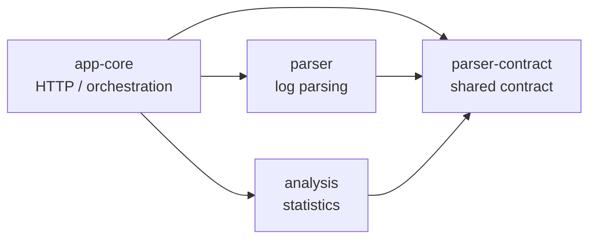
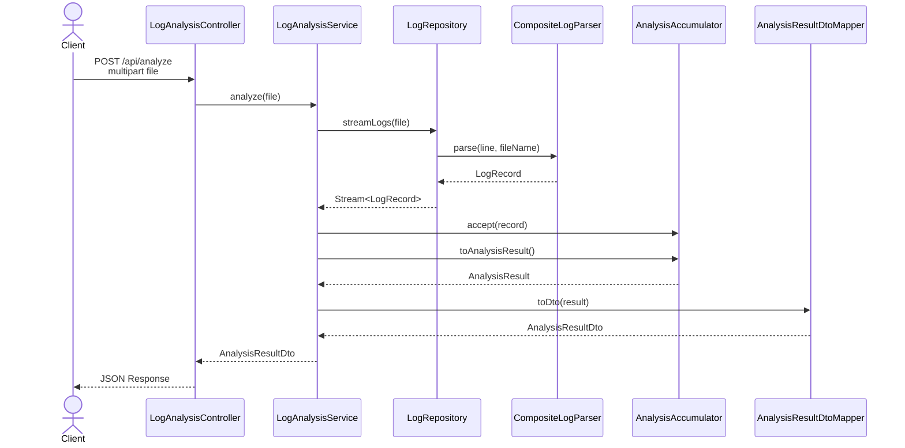

# Log Analyzer

## 프로젝트 요약

- **로그 파일 분석 API**: 업로드된 로그 파일을 파싱하고 주요 사용 통계를 JSON으로 반환하는 Spring Boot 기반 API입니다.
- **멀티 포맷 파서 구조**: bracket 형식 로그와 JSON line 형식 로그를 각각의 파서로 분리하고, 입력 내용과 파일명 힌트를 기반으로 적절한 파서를 선택합니다.
- **스트리밍 기반 통계 처리**: 전체 로그를 메모리에 적재하지 않고 `Stream<LogRecord>`를 순회하며 누적 상태를 갱신하는 방식으로 분석합니다.
- **Gradle 멀티모듈 설계**: `app-core`, `parser-contract`, `parser`, `analysis` 모듈로 책임을 분리한 modular monolith 구조입니다.
- **확장 가능한 분석 경계**: 새로운 로그 포맷은 `LogParser` 구현체로, 새로운 통계 항목은 `AnalysisAccumulator` 확장으로 추가할 수 있습니다.

## 1. 프로젝트 개요

Log Analyzer는 로그 파일을 업로드하면 API Key, 서비스 ID, 브라우저 사용 비율 등 핵심 통계를 계산해 JSON으로 반환하는 로그 분석 프로젝트입니다.

단순히 파일을 읽고 결과를 반환하는 구조가 아니라, 로그 파싱 책임과 통계 계산 책임을 독립된 모듈로 분리했습니다. 이를 통해 HTTP 요청 처리 계층은 파싱 규칙이나 분석 로직을 직접 알지 않고, 각 모듈을 조합하는 역할만 수행하도록 구성했습니다.

### 프로젝트 정보

| 항목 | 내용 |
| --- | --- |
| 저장소 | `Jungwoook/log-analyzer` |
| 형태 | 개인 프로젝트 |
| 주요 기능 | 로그 파일 업로드, 로그 포맷 판별, 통계 분석, JSON 응답 |
| 기술 스택 | Java 17, Spring Boot 3.5.10, Gradle Multi Module, Jackson, SLF4J, Logback |
| API | `POST /api/analyze` |

## 2. 시스템 구조

이 프로젝트는 하나의 Spring Boot 애플리케이션으로 배포되지만, 내부 구조는 Gradle 멀티모듈 기반의 modular monolith로 분리되어 있습니다.

```text
log-analyzer
├─ app-core
├─ parser-contract
├─ parser
└─ analysis
```

### 모듈 의존 방향



핵심 제약은 `parser`와 `analysis`가 `app-core`에 의존하지 않는다는 점입니다. 이 구조 덕분에 HTTP 계층, 파싱 계층, 분석 계층의 책임이 모듈 경계로 고정됩니다.

## 3. 모듈별 책임

### `app-core`

애플리케이션 진입점과 요청 처리 흐름을 담당합니다.

| 구성 | 역할 |
| --- | --- |
| `LogAnalyzerApplication` | Spring Boot 애플리케이션 실행 |
| `LogAnalysisController` | `multipart/form-data` 기반 로그 파일 업로드 API 제공 |
| `LogAnalysisService` | 파일 스트림, 파서, 분석기를 조합하는 오케스트레이션 수행 |
| `LogRepository` | 업로드 파일을 UTF-8 라인 스트림으로 읽고 `LogRecord` 스트림으로 변환 |
| `AnalysisResultDtoMapper` | 분석 결과 도메인 모델을 응답 DTO로 변환 |
| `GlobalExceptionHandler` | 파싱 실패와 내부 처리 오류를 HTTP 응답으로 매핑 |

### `parser-contract`

파서와 분석 모듈이 공유하는 최소 계약을 정의합니다.

| 구성 | 역할 |
| --- | --- |
| `LogParser` | 로그 파서 인터페이스 |
| `LogRecord` | 파싱된 로그의 공통 모델 |
| `ParserContext` | 입력 라인과 파일명 정보를 담는 컨텍스트 |
| `InvalidLogFormatException` | 지원하지 않거나 잘못된 로그 형식 예외 |

### `parser`

로그 형식을 판별하고 공통 모델인 `LogRecord`로 변환합니다.

| 구성 | 역할 |
| --- | --- |
| `CompositeLogParser` | 등록된 파서 목록 중 적절한 파서를 선택해 파싱 수행 |
| `ParserSelectionPolicy` | 내용 기반 판별을 우선하고, 필요 시 파일명 힌트로 후보를 좁힘 |
| `KokoaLogParser` | bracket 형식 로그 파싱 |
| `MaverLogParser` | JSON line 형식 로그 파싱 |
| `UrlFieldExtractor` | URL에서 API Key, 서비스 ID 등 분석 필드 추출 |
| `KokoaServiceIdPolicy`, `MaverServiceIdPolicy` | 로그 소스별 서비스 ID 정규화 정책 |

### `analysis`

`LogRecord` 스트림을 입력받아 통계 결과를 계산합니다.

| 구성 | 역할 |
| --- | --- |
| `AnalysisAccumulator` | API Key, 서비스 ID, 브라우저별 누적 상태 관리 |
| `AnalysisResult` | 분석 결과 도메인 모델 |
| `TopServiceCount` | 상위 서비스 집계 결과 모델 |

## 4. 요청 처리 흐름

분석 요청은 컨트롤러에서 시작해 파일 스트림, 파서, 분석 누적기, 응답 DTO 변환 순서로 처리됩니다.



`LogAnalysisService`는 직접 파싱 규칙이나 통계 계산 규칙을 구현하지 않습니다. 대신 `LogRepository`에서 생성한 `Stream<LogRecord>`를 `AnalysisAccumulator`에 전달하고, 최종 결과를 DTO로 변환하는 조립 책임에 집중합니다.

## 5. 스트리밍 분석 방식

로그 분석은 전체 파일을 리스트로 모은 뒤 일괄 처리하는 방식이 아니라, 라인을 읽으면서 즉시 누적 상태를 갱신하는 방식으로 구성되어 있습니다.

### 기존 방식의 개념

```text
Stream<LogRecord> -> toList() -> batch analyze
```

### 현재 방식

```text
Stream<LogRecord> -> accumulator.accept(record) -> accumulator.toAnalysisResult()
```

이 방식은 중간 컬렉션 생성을 줄이고, 분석 책임을 `AnalysisAccumulator`에 집중시킵니다. 로그 파일 크기가 커지더라도 전체 레코드를 한 번에 보관하지 않고 필요한 집계 상태만 유지할 수 있습니다.

## 6. 지원 로그 형식

현재 구현 기준으로 두 가지 로그 소스를 지원합니다.

| 로그 소스 | 형식 | 주요 필드 |
| --- | --- | --- |
| Kokoa | bracket 형식 | status code, URL, browser, timestamp |
| Maver | JSON line 형식 | `status_code`, `url`, `browser`, `service_id`, `api_key`, `@timestamp` |

### Kokoa 로그 예시

```text
[200][/search/news?apikey=a1b2][Chrome][2024-01-01 12:00:00]
```

### Maver 로그 예시

```json
{
  "status_code": 200,
  "url": "/search/news?apikey=a1b2",
  "browser": "Chrome",
  "service_id": "news",
  "api_key": "a1b2",
  "@timestamp": "2024-01-01T12:00:00"
}
```

파서 선택은 `ParserSelectionPolicy`에서 처리합니다. 먼저 라인 내용으로 파서를 판별하고, 여러 파서가 동시에 매칭되거나 내용만으로 판단할 수 없는 경우 파일명 힌트를 사용합니다. 그래도 판별할 수 없으면 `InvalidLogFormatException`을 발생시켜 잘못된 입력임을 명확히 드러냅니다.

## 7. 분석 결과

API 응답은 다음 세 가지 통계를 중심으로 구성됩니다.

| 분석 항목 | 설명 | 정렬 기준 |
| --- | --- | --- |
| 최다 호출 API Key | 가장 많이 호출된 API Key | 호출 수 내림차순, 동률 시 API Key 오름차순 |
| 상위 3개 서비스 ID | 호출 수 기준 상위 3개 서비스 | 호출 수 내림차순, 동률 시 서비스 ID 오름차순 |
| 브라우저별 사용 비율 | 전체 브라우저 집계 대비 각 브라우저 비율 | 브라우저명 오름차순 |

### 응답 예시

```json
{
  "mostCalledApiKey": "a1b2",
  "top3Services": [
    { "serviceId": "news", "count": 120 },
    { "serviceId": "book", "count": 95 },
    { "serviceId": "map", "count": 72 }
  ],
  "browserRatio": {
    "Chrome": 55.5,
    "Safari": 31.2,
    "Whale": 13.3
  }
}
```

## 8. API 명세

### 로그 분석

| 항목 | 내용 |
| --- | --- |
| Method | `POST` |
| Path | `/api/analyze` |
| Content-Type | `multipart/form-data` |
| Form field | `file` |
| Response | `AnalysisResultDto` |

### 요청 예시

```bash
curl -X POST "http://localhost:8080/api/analyze" \
  -F "file=@./sample.log"
```

## 9. 예외 처리와 로깅

예외는 사용자 입력 문제와 내부 처리 문제로 구분됩니다.

| 예외 | 의미 | 처리 방향 |
| --- | --- | --- |
| `InvalidLogFormatException` | 지원하지 않거나 잘못된 로그 형식 | 사용자 입력 문제로 응답 |
| `LogProcessingException` | 파일 처리 또는 예상하지 못한 내부 오류 | 서버 처리 문제로 응답 |

주요 로그 이벤트는 다음과 같습니다.

- 분석 시작과 종료
- 파일 파싱 시작과 종료
- 처리된 레코드 수
- 통계 계산 시작과 종료
- 라인 번호 기반 파싱 실패 경고
- 예상하지 못한 내부 오류

로그 파일 경로는 `logs/log-analyzer.log`로 정리되어 있습니다.

## 10. 주요 설계 포인트

### 모듈 경계로 책임 분리

`app-core`는 HTTP 요청 처리와 흐름 제어에 집중하고, `parser`와 `analysis`는 각각 파싱과 통계 계산만 담당합니다. 이 구조는 구현 변경이 특정 모듈 안에 머물도록 만들어 유지보수 비용을 줄입니다.

### 공통 계약 중심의 확장성

`parser-contract`에 `LogParser`, `LogRecord`, `ParserContext`를 분리해두었기 때문에 새로운 파서와 분석기는 애플리케이션 진입점에 직접 의존하지 않고 확장할 수 있습니다.

### 파서 선택 정책 분리

로그 포맷 판별 규칙은 `ParserSelectionPolicy`에 모여 있습니다. 파서 구현체는 자신이 처리할 수 있는 입력인지 판단하고 실제 파싱을 수행하며, 여러 파서 후보를 해소하는 정책은 별도 클래스로 분리했습니다.

### 누적기 기반 통계 계산

`AnalysisAccumulator`는 API Key, 서비스 ID, 브라우저별 카운트를 누적하고 최종 시점에 결과 모델을 생성합니다. 분석 중간에 전체 레코드 목록을 보관하지 않아도 되므로 통계 계산 흐름이 단순하고 메모리 사용 측면에서도 유리합니다.

## 11. 문제 해결 및 개선 과정

| 문제 상황 | 개선 내용 | 결과 |
| --- | --- | --- |
| 로그 포맷 증가로 파싱 로직 복잡도 증가 | - `LogParser` 인터페이스 정의<br>- Kokoa, Maver 로그를 포맷별 파서 구현체로 분리<br>- `CompositeLogParser`, `ParserSelectionPolicy`로 입력 내용과 파일명 힌트 기반 파서 선택 | - 새 로그 형식 추가 시 기존 분석 흐름 수정 최소화<br>- 파서 구현체 추가 방식으로 확장 가능 |
| HTTP 요청 처리와 파싱/분석 책임 혼재 가능성 | - Gradle 멀티모듈 구조 적용<br>- `app-core`, `parser-contract`, `parser`, `analysis`로 책임 분리<br>- `app-core`는 요청 처리와 오케스트레이션에 집중 | - HTTP 계층, 파싱 계층, 분석 계층의 의존 방향 명확화<br>- 변경 범위를 특정 모듈 안으로 제한 |
| 전체 로그 적재 방식의 중간 데이터 부담 | - `Stream<LogRecord>` 기반 처리 흐름 적용<br>- `AnalysisAccumulator`로 필요한 통계 상태만 누적<br>- 전체 로그 컬렉션 생성 없이 분석 결과 생성 | - 중간 컬렉션 생성 감소<br>- API Key, 서비스 ID, 브라우저 비율 통계 계산 흐름 단순화 |

## 12. 확장 방법

### 새로운 로그 형식 추가

1. `parser-contract`의 `LogParser`를 구현합니다.
2. `supports(ParserContext)`와 `parse(ParserContext)`를 작성합니다.
3. 필요하면 `supportsFileName(String fileName)`으로 파일명 힌트도 제공합니다.
4. URL 기반 필드 추출이 필요하면 `UrlFieldExtractor`와 서비스 ID 정책을 재사용합니다.
5. `parser` 모듈에 파서 단위 테스트를 추가합니다.

### 새로운 분석 항목 추가

1. `AnalysisAccumulator`에 필요한 누적 상태를 추가합니다.
2. `accept(LogRecord)`에서 새 통계에 필요한 필드를 누적합니다.
3. `AnalysisResult`를 확장합니다.
4. `AnalysisResultDto`와 `AnalysisResultDtoMapper`를 함께 갱신합니다.
5. `analysis`와 `app-core` 테스트로 계산 결과와 응답 형태를 검증합니다.

## 13. 구현 결과

이 프로젝트를 통해 로그 분석 기능을 단일 API로 제공하면서도 내부 구현은 모듈별로 명확히 분리했습니다.

특히 `parser-contract`를 중심에 둔 구조는 파싱과 분석 모듈이 HTTP 계층에 종속되지 않게 만들고, `AnalysisAccumulator` 기반 처리 방식은 로그 스트림을 읽는 즉시 필요한 통계만 누적하도록 구성합니다. 그 결과 작은 API 프로젝트 안에서도 확장 가능한 모듈 경계, 입력 포맷별 파서 분리, 스트리밍 기반 분석이라는 설계 포인트를 보여줄 수 있습니다.
